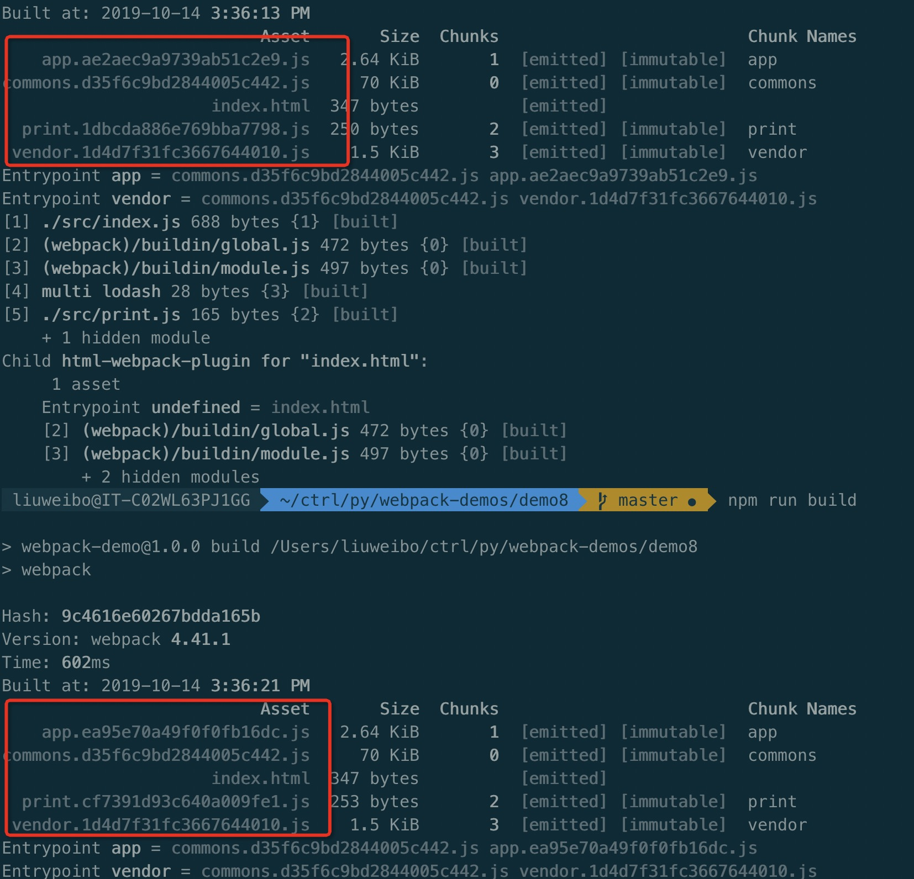
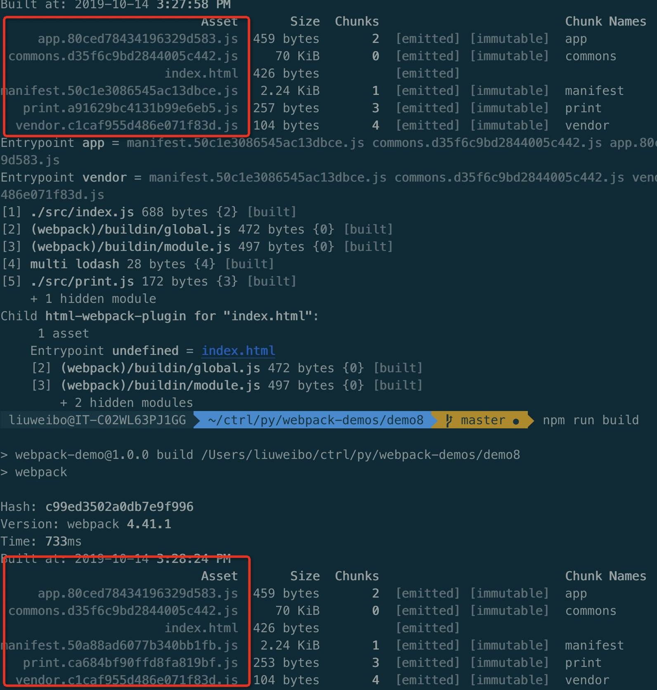

This repo is a collection of simple demos of Webpack.
## How to use
```sh
git clone https://github.com/Weibozzz/webpack-demos.git
cd webpack-demos/demo1
npm install
npm start
```

Some command-line options you should know.

- `webpack` – building for development
- `webpack -p` – building for production (minification)
- `webpack --watch` – for continuous incremental building
- `webpack -d` – including source maps
- `webpack --colors` – making building output pretty

You could customize `scripts` field in your package.json file as following.

```javascript
// package.json
{
  // ...
  "scripts": {
    "dev": "webpack-dev-server --devtool eval --progress --colors",
    "deploy": "NODE_ENV=production webpack -p"
  },
  // ...
}
```


## Index
1. [起步](#demo1-起步)
1. [管理资源](#demo2-管理资源)
1. [管理输出](#demo3-管理输出)
1. [模块热替换（HMR）](#demo4-模块热替换（HMR）)
1. [tree shaking](#demo5-tree-shaking)
1. [代码分离](#demo6-代码分离)
1. [懒加载](#demo7-懒加载)
1. [缓存](#demo8-缓存)
1. [创建 library](#demo9-创建-library)
1. [shimming 全局变量](#demo10-shimming-全局变量)
1. [配置react和CSS Module](#demo11-配置react和CSS-Module)
1. [生产环境构建](#demo12-生产环境构建)

## webpack 4.41.0 指南
## demo1 起步
webpack基本使用

## demo2 管理资源
- 加载css
- 加载图片 xml csv

## demo3 管理输出
- [clean-webpack-plugin 清理 /dist 文件夹](https://github.com/johnagan/clean-webpack-plugin)
- [将 CSS 分离成单独的文件](https://github.com/webpack-contrib/mini-css-extract-plugin)

## demo4 模块热替换（HMR）

模块热替换(Hot Module Replacement 或 HMR)是 webpack 提供的最有用的功能之一。
它允许在运行时更新各种模块，而无需进行完全刷新。

每点击一下add Item按钮就会在页面上增加一个item元素，奇数元素的背景色为粉色。
如果这时候改一下背景色：
页面会重新刷新，那么之前添加的item就都没了。

### 模块热替换
无刷新热替换

<https://www.webpackjs.com/guides/hot-module-replacement/>

```js
// 无刷新热更新
if (module.hot) {
  module.hot.accept('./print.js', function () {
    console.log('Accepting the updated printMe module!')
    printMe()
  })
}
```

## demo5 tree shaking
用于描述移除 JavaScript 上下文中的未引用代码(dead-code)

**测试发现 mode为production的时候已经自动去掉**

## demo6 代码分离
插件可以将公共的依赖模块提取到已有的入口 chunk 中，或者提取到一个新生成的 chunk。
让我们使用这个插件，将之前的示例中重复的 lodash 模块去除

```js
optimization: {
    splitChunks: {
      cacheGroups: {
        commons: {
          name: 'commons',
          chunks: 'initial',
          minChunks: 2
        }
      }
    }
  },
```

- [optimization文档](https://www.webpackjs.com/plugins/split-chunks-plugin/#optimization-splitchunks-chunks-all)
- [bundle 分析(bundle analysis)](https://github.com/webpack-contrib/webpack-bundle-analyzer)

## demo7 懒加载
> 懒加载或者按需加载，是一种很好的优化网页或应用的方式。
这种方式实际上是先把你的代码在一些逻辑断点处分离开，
然后在一些代码块中完成某些操作后，立即引用或即将引用另外一些新的代码块。
这样加快了应用的初始加载速度，减轻了它的总体体积，**因为某些代码块可能永远不会被加载**。

```js
// 例子
button.onclick = e => import(/* webpackChunkName: "print" */ './print').then(module => {
    var print = module.default
    print()
  })
```
## demo8 缓存
> 我们在部署新版本时不更改资源的文件名，浏览器可能会认为它没有被更新，就会使用它的缓存版本。

-  把公共库提取出来
```
entry: {
    app: './src/index.js',
    vendor: ['lodash','jquery','react']
  }
```
- 输出文件的文件名(Output Filenames)

通过使用 output.filename 进行文件名替换，可以确保浏览器获取到修改后的文件。
`filename: '[name].[chunkhash].js'`

- 提取模板(Extracting Boilerplate)

每次 `print.js` 文件修改之后都会造成 `app print` 重新打包,甚至导致`vender`。那么如何解决这个问题呢。

```js
optimization: {
    runtimeChunk: {
      name: 'manifest'
    },
  },
```

解决的方法是利用一个 `manifest` 来记录 vendor 的 id ，
如果`vendor`没改变，则不需要重新打包。

让我们再次构建，然后查看提取出来的 `manifest bundle`：

重新打包发现`print.js`的`hash`变化了相当于重新打包了`print.js`，

## demo9 创建 library
> 由于webpack打包后不会暴露全剧变量，用户不可通过script引入，需要暴露出来。
CommonJS，AMD，Node.js 或者作为一个全局变量。
为了让你的 library 能够在各种用户环境(consumption)中可用，
需要在 output 中添加 library 属性：

该 library 的使用方式如下：
```js

// ES2015 模块引入
import * as webpackNumbers from 'webpack-numbers';
// CommonJS 模块引入
var webpackNumbers = require('webpack-numbers');
// ...
// ES2015 和 CommonJS 模块调用
webpackNumbers.wordToNum('Two');
// ...
// AMD 模块引入
require(['webpackNumbers'], function ( webpackNumbers) {
  // ...
  // AMD 模块调用
  webpackNumbers.wordToNum('Two');
  // ...
});
```
用户还可以通过 script 标签来加载和使用此 library：
```html
<!doctype html>
<html>
  ...
  <script src="https://unpkg.com/webpack-numbers"></script>
  <script>
    // ...
    // 全局变量
    webpackNumbers.wordToNum('Five')
    // window 对象中的属性
    window.webpackNumbers.wordToNum('Five')
    // ...
  </script>
</html>
```
暴露 `library`

```js
    output: {
      path: path.resolve(__dirname, 'dist'),
      filename: 'webpack-numbers.js'
      library: 'webpackNumbers'
    },
```
打包后可以看到 `webpack-numbers.js` 中源码  `var webpackNumbers=function(e)...`

可通过[output.libraryTarget](https://www.webpackjs.com/configuration/output/#output-librarytarget)配置

## demo10 shimming 全局变量

还记得我们之前用过的 `lodash` 吗？出于演示的目的，
让我们把这个模块作为我们应用程序中的一个全局变量。要实现这些，
我们需要使用 `ProvidePlugin` 插件。

使用 `ProvidePlugin` 后，能够在通过 `webpack` 
编译的每个模块中，通过访问一个变量来获取到 `package` 包。
如果 `webpack` 知道这个变量在某个模块中被使用了，那么 `webpack` 
将在最终 `bundle` 中引入我们给定的 `package`。让我们先移除 `lodash` 的 `import` 语句，
并通过插件提供它：

## demo11 配置react和CSS Module
配置`.babelrc`文件
```
{
  "presets": ["@babel/preset-env", "@babel/preset-react"]
}
```
- babel preset env 负责将ES6语法转换成ES5
- babel preset react 负责将JSX语法转化为JavaScript

配置 css module
```
{
        test: /\.css$/,
        use: [
          {
            loader: 'style-loader'
          },
          {
            loader: 'css-loader',
            options: {
              modules: true
            }
          }
        ]
}
```
## demo12 生产环境构建
开发环境(development)和生产环境(production)的构建目标差异很大

- webpack.dev.js
- webpack.prod.js
- webpack.common.js
- [source map](https://www.webpackjs.com/configuration/devtool/)
- [指定环境 process.env.NODE_ENV] (https://www.webpackjs.com/guides/production/#%E6%8C%87%E5%AE%9A%E7%8E%AF%E5%A2%83)
